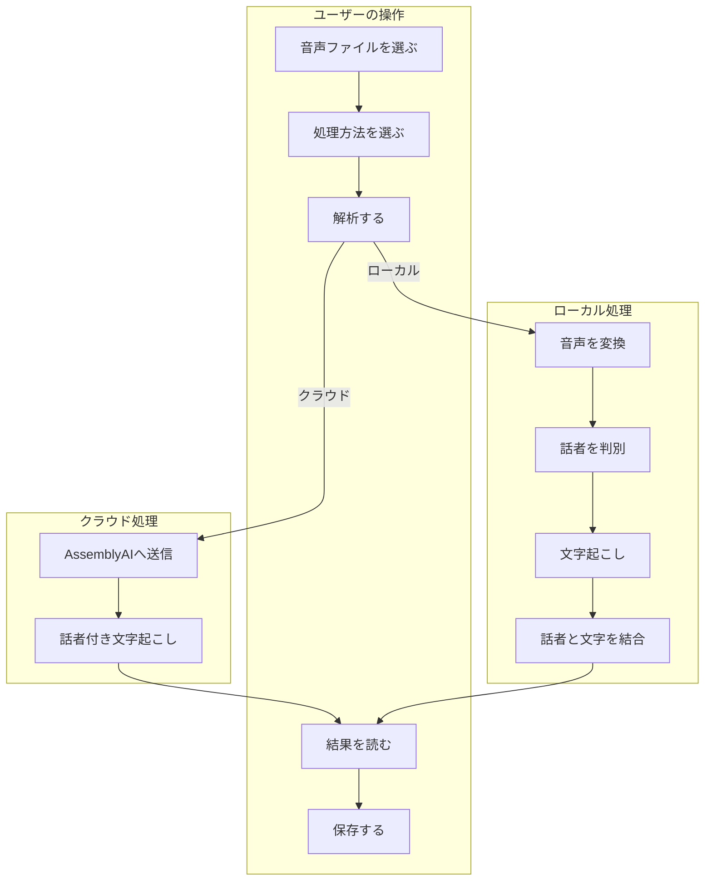
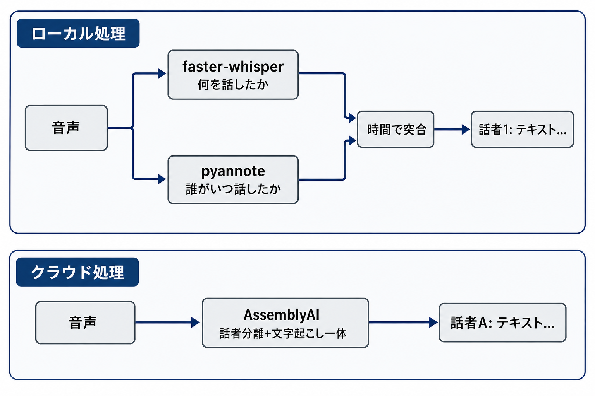

# 豊聡耳（とよとみみ）ユーザーガイド

**バージョン: v0.1.0**

このガイドは、プログラミングの知識がない方でも豊聡耳を使えるように書いています。アプリのインストール方法は [README](../README.md) を参照してください。

---

## 目次

1. [このアプリでできること](#1-このアプリでできること)
2. [全体像](#2-全体像)
3. [事前準備](#3-事前準備)
4. [画面の説明](#4-画面の説明)
5. [基本的な使い方](#5-基本的な使い方)
6. [話者分離について](#6-話者分離について)
7. [結果の保存形式](#7-結果の保存形式)
8. [設定項目一覧](#8-設定項目一覧)
9. [制限と注意事項](#9-制限と注意事項)
10. [よくあるエラーと対処](#10-よくあるエラーと対処)
11. [用語集](#11-用語集)

---

## 1. このアプリでできること

**豊聡耳**は、会議・インタビュー・録音などの**音声ファイル**を読み込み、AI が次の2つを同時に行うデスクトップアプリです。

- **話者分離** — 誰が話したかを区別する（話者1、話者2 …）
- **文字起こし** — 話した内容をテキストにする

### こんな用途に向いています

- 複数人の会議録を、発言者ごとに整理したい
- インタビュー音声を、質問者と回答者に分けて文字にしたい
- ポッドキャストや対談の内容を読み物として残したい

### このアプリではできないこと

- 話者の**実名**（田中さん、佐藤さんなど）を自動で特定する
- マイクからの**リアルタイム録音**（あらかじめ保存したファイルが必要）
- 動画ファイルの映像解析（音声部分のみ処理します）

---

## 2. 全体像

### ユーザー操作の流れ



### 処理のしくみ（クラウドとローカル）

同じ「話者付き文字起こし」でも、**クラウド**と**ローカル**では AI の働き方が異なります。



- **クラウド:** 音声を AssemblyAI に送ると、**話者分離と文字起こしをまとめて**行い、結果が返ってきます。
- **ローカル:** PC 内で **2つの AI** が別々に働きます。
  1. **pyannote** — 誰がいつ話したかを分析
  2. **faster-whisper** — 何を話したかを文字起こし
  3. アプリが **時間で突合** し、「話者1: テキスト…」の形にまとめます

### 2つの処理方法

豊聡耳には **クラウド** と **ローカル** の2通りの処理方法があります。メイン画面の「処理方法」から切り替えられます。

| 項目 | クラウド | ローカル |
|------|----------|----------|
| 処理の場所 | インターネット上のサービス（AssemblyAI） | お使いの PC 内 |
| 速度 | 速い | PC の性能次第（GPU があれば速い） |
| 精度 | 高い | 良好（モデルサイズに依存） |
| 料金 | 無料クレジットあり（使い切ると有料） | 無料（初回のみモデルダウンロード） |
| オフライン | 不可（インターネット必須） | モデル取得後は可能 |
| 必要なキー | AssemblyAI API キー | Hugging Face トークン |
| 話者ラベル | 話者A, 話者B … | 話者1, 話者2 … |

> **ポイント:** クラウド処理では Hugging Face トークンは**使いません**。ローカル処理では AssemblyAI の API キーは**使いません**。使う処理方法に合わせて、必要なキーだけ設定してください。

### 利用上限の目安

#### クラウド（AssemblyAI）

- 新規登録で **$50 分の無料クレジット**（クレジットカード不要）
- クレジットは**使い切るまで有効**（毎月リセットではない）
- 音声が長いほど、1回の解析で消費するクレジットが増える
- 無料枠では**同時に5件まで**の解析が上限
- 詳細: [AssemblyAI 料金ページ](https://www.assemblyai.com/pricing)

#### ローカル（Hugging Face）

- トークン自体は**無料**で取得できる
- 初回のみ AI モデルのダウンロードで Hugging Face に接続する
- 2回目以降は PC 内のキャッシュを使うため、通常は通信がほとんど発生しない
- 短時間に大量ダウンロードすると一時的に制限（429 エラー）がかかることがある

---

## 3. 事前準備

### 必要なもの

| 項目 | クラウド | ローカル |
|------|:--------:|:--------:|
| 豊聡耳アプリ本体 | 必要 | 必要 |
| インターネット接続 | 必要 | 初回のみ必要 |
| ffmpeg（音声変換ソフト） | 不要 | 必要 |
| AssemblyAI API キー | 必要 | 不要 |
| Hugging Face トークン | 不要 | 必要 |

### 処理に必要な追加パッケージ（ソースから起動する場合）

スタートメニューやデスクトップから起動する**配布版**には、使う処理方法に応じた部品があらかじめ入っています。

**README の手順でソースから起動する場合**（`uv run toyotomimi` や `.venv\Scripts\toyotomimi.exe` など）は、使う処理方法に合わせて **追加パッケージを事前インストール** する必要があります。アプリ本体だけでは文字起こしエンジンは含まれません。

| 使う処理方法 | 事前に実行するコマンド（プロジェクトフォルダで） |
|-------------|------------------------------------------------|
| **クラウドだけ** | `uv sync --extra cloud` |
| **ローカルだけ** | `uv sync --extra local` |
| **両方** | `uv sync --extra cloud --extra local` |

- **クラウド用**（`--extra cloud`）: AssemblyAI 連携ライブラリ（`assemblyai`）が入ります。容量は小さめです。
- **ローカル用**（`--extra local`）: 文字起こし・話者分離 AI（`torch` など）が入ります。容量は大きめです。
- **両方の処理方法を切り替えて使う**場合は、最後に `--extra cloud --extra local` を実行しておくと、どちらも使えます。
- インストール後は **豊聡耳を一度終了して再起動** してから解析してください。

`uv` コマンドが見つからない場合の詳しい手順は [README のセットアップ](../README.md#セットアップ) を参照してください。

### API キー・トークンの取得

#### クラウド用: AssemblyAI API キー

1. [AssemblyAI](https://www.assemblyai.com/) でアカウントを作成
2. ダッシュボードから API キーをコピー
3. 豊聡耳の「設定」画面に貼り付け

#### ローカル用: Hugging Face トークン

1. [Hugging Face](https://huggingface.co/) でアカウントを作成（無料）
2. [トークン設定ページ](https://huggingface.co/settings/tokens) で **Read 権限**のトークンを作成（**Fine-grained より Read が簡単**。Google / Gemini のトークンは使えません）
3. 次の3つのモデルページを開き、それぞれ **Agree and access repository**（利用規約に同意）をクリック
   - [pyannote/speaker-diarization-3.1](https://huggingface.co/pyannote/speaker-diarization-3.1)
   - [pyannote/segmentation-3.0](https://huggingface.co/pyannote/segmentation-3.0)
   - [pyannote/speaker-diarization-community-1](https://huggingface.co/pyannote/speaker-diarization-community-1)
4. 豊聡耳の「設定」画面にトークンを貼り付け

> **補足:** 登録直後に「組織に参加（Join an organization）」と表示されても、**個人利用ならスキップして構いません**。403 エラーが出た場合、3モデルのうち**未同意のページが残っていないか**確認してください。エラーに表示されるモデル名が変わりながら出ることがあります。

### 設定の保存場所

- アプリ内「設定」画面で入力した内容は、PC の **`~/.toyotomimi/config.json`** に保存されます
  - Windows の例: `C:\Users\（ユーザー名）\.toyotomimi\config.json`
- 管理者が `.env` ファイルで環境変数を設定している場合、**そちらが優先**されます

---

## 4. 画面の説明

### メイン画面

アプリを起動すると表示される画面です。

| 要素 | 説明 |
|------|------|
| タイトル | 「豊聡耳 — 話者分離つき文字起こし」 |
| ファイル状態 | 選択した音声ファイルのパス（未選択時は灰色の案内文） |
| **ファイルを選択...** | 音声ファイルを選ぶボタン |
| **処理方法** | 「クラウド」か「ローカル」を選ぶプルダウン |
| **解析する** | 文字起こしを開始するボタン |
| 進捗バー | 解析中のみ表示される |
| ステータス | 現在の状態（解析中・完了・エラーなど） |
| 結果エリア | 話者ラベル付きの文字起こし結果が表示される |
| **結果を保存...** | 解析完了後に結果をファイル保存するボタン |

**メニュー「ファイル」**

| メニュー項目 | 説明 |
|-------------|------|
| 設定... | 設定画面を開く |
| 終了 | アプリを終了する |

### 設定画面

メニュー「ファイル → 設定...」から開きます。

| 項目 | 説明 |
|------|------|
| AssemblyAI API キー | クラウド処理用（パスワード形式で表示） |
| Hugging Face トークン | ローカル処理用（パスワード形式で表示） |
| 言語 | 日本語 / 英語 / 自動判定 |
| ローカルモデルサイズ | tiny 〜 large-v3（ローカル処理時のみ使用） |
| OK / Cancel | 設定を保存して閉じる / 変更を破棄して閉じる |

---

## 5. 基本的な使い方

### 手順

1. **アプリを起動する**
   - インストール済みの場合: デスクトップまたはスタートメニューから起動
   - 開発環境の場合: README の「起動」セクションを参照

2. **（初回のみ）設定でキーを入力する**
   - メニュー「ファイル → 設定...」を開く
   - 使う処理方法に応じて API キーまたは HF トークンを入力
   - OK を押して保存

3. **音声ファイルを選択する**
   - 「ファイルを選択...」をクリック
   - 対応形式: mp3, wav, m4a, flac, ogg, mp4, aac など
   - 音声ファイルは **PC 上の任意の場所** に置いて構いません（プロジェクトフォルダや特定の input フォルダは不要）

4. **処理方法を選ぶ**
   - クラウド: 速くて高精度。インターネットと API キーが必要
   - ローカル: オフライン可能。HF トークンと ffmpeg が必要

5. **「解析する」を押す**
   - 解析中はボタンが無効になり、進捗バーとステータスが更新される
   - クラウド: 数十秒〜数分（音声の長さによる）
   - ローカル: 数分〜（PC の性能と音声の長さによる。初回はモデル読み込みでさらに時間がかかる）

6. **結果を確認する**
   - 結果エリアに次の形式で表示されます:
     ```
     話者1: おはようございます。
     話者2: おはようございます。本日はよろしくお願いします。
     話者1: こちらこそ、よろしくお願いします。
     ```
   - ステータスに「完了 — 話者 N 名 / M 区間」と表示される

7. **（任意）結果を保存する**
   - 「結果を保存...」をクリック
   - 保存形式（txt / srt / json）を選んで保存先を指定

### 解析中に表示されるメッセージ

**クラウド処理**

1. AssemblyAI にアップロードして解析中...
2. 結果を整形中...
3. 完了

**ローカル処理**

1. 音声を変換中...
2. 話者分離モデルを読み込み中...（初回はダウンロードも発生）
3. 話者を分析中...
4. 文字起こしモデルを読み込み中...
5. 文字起こし中...
6. 完了

---

## 6. 話者分離について

### 話者分離と文字起こしの違い

| 用語 | 意味 | 例 |
|------|------|-----|
| **話者分離** | 声の違いから「誰が話したか」を区別する | 話者1 が 0:00〜0:15、話者2 が 0:15〜0:30 |
| **文字起こし** | 話した内容を文字にする | 「本日の議題についてお話しします」 |

豊聡耳はこの2つを組み合わせて、**誰が何を話したか**を1つの結果として出力します。

### 話者ラベルについて

- 話者は **「話者1」「話者2」**（ローカル）または **「話者A」「話者B」**（クラウド）のように番号やアルファベットで表示されます
- **実名（田中さん、佐藤さんなど）は自動では分かりません**
- 同じ人でも、別の音声ファイルでは別の番号になることがあります

### 処理方法による違い

**クラウド:** 1つのサービス（AssemblyAI）が、話者分離と文字起こしを**同時に**行います。

**ローカル:** 2つの AI が別々に処理し、アプリが時間情報で結合します。

1. pyannote — 「いつ・誰が話したか」を分析
2. faster-whisper — 「何を話したか」を文字起こし
3. アプリ — 時間が重なる部分を照合して話者ラベルを付ける

### 精度の限界

次のような場合、話者の判別や文字起こしの精度が下がることがあります。

- **声が似ている人**（同じ性別・似た声質）がいる
- **同時に話している**（被り・相槌が多い）
- **雑音やエコー**が入っている
- **音質が低い**（電話録音、遠くのマイクなど）
- **話者が非常に多い**（5人以上など）

---

## 7. 結果の保存形式

解析完了後、「結果を保存...」から3つの形式で保存できます。拡張子で自動的に形式が決まります。

| 形式 | 拡張子 | こんな時に使う | 内容の例 |
|------|--------|---------------|----------|
| **テキスト** | `.txt` | メモ・議事録として読む | `話者1: こんにちは` |
| **SRT 字幕** | `.srt` | 動画編集ソフトで字幕に使う | タイムコード付きの字幕データ |
| **JSON** | `.json` | 他のソフトやプログラムに渡す | 話者・時刻・テキストの構造化データ |

### 画面表示と txt 保存の違い

- **画面表示:** 話者ラベルとテキストのみ（ヘッダ行なし）
- **txt 保存:** 先頭に `# 文字起こし結果 (エンジン: ..., 言語: ...)` というヘッダ行が付く

### 保存例（txt）

```
# 文字起こし結果 (エンジン: AssemblyAI (クラウド), 言語: ja)

話者A: 本日の議題についてお話しします。
話者B: 承知しました。
```

### 保存例（srt）

```
1
00:00:00,000 --> 00:00:05,200
話者A: 本日の議題についてお話しします。

2
00:00:05,500 --> 00:00:07,800
話者B: 承知しました。
```

---

## 8. 設定項目一覧

| 設定項目 | 初期値 | 選択肢 | 備考 |
|----------|--------|--------|------|
| 処理方法 | クラウド | クラウド / ローカル | メイン画面でも変更可能 |
| 言語 | 日本語 | 日本語 / 英語 / 自動判定 | |
| ローカルモデルサイズ | small | tiny / base / small / medium / large-v3 | ローカル処理時のみ。大きいほど精度↑・速度↓ |
| AssemblyAI API キー | （空） | — | クラウド処理時に必要 |
| Hugging Face トークン | （空） | — | ローカル処理時に必要 |

### モデルサイズの目安（ローカル処理）

| サイズ | 速度 | 精度 | おすすめ |
|--------|------|------|----------|
| tiny | 最速 | 低め | お試し・短い音声 |
| base | 速い | やや低め | |
| **small** | 普通 | 良好 | **初期値（バランス型）** |
| medium | やや遅い | 高い | 精度重視 |
| large-v3 | 遅い | 最高 | 長時間音声・高精度が必要な場合 |

---

## 9. 制限と注意事項

### 処理時間

- **クラウド:** 音声の長さに比例。通常は比較的速い
- **ローカル（CPU のみ）:** 長い音声ほど時間がかかる（1時間の音声で数十分かかることも）
- **ローカル（GPU あり）:** CPU より大幅に速くなる
- 初回のローカル処理は AI モデルのダウンロード・読み込みで追加時間がかかる

### 料金・利用上限

- **クラウド:** 無料クレジット（$50 分）を超えると有料。残高は [AssemblyAI ダッシュボード](https://www.assemblyai.com/) で確認
- **ローカル:** 解析自体は無料。初回のモデルダウンロード時のみ Hugging Face への通信が発生

### プライバシー

- **クラウド:** 音声ファイルが AssemblyAI のサーバーに送信される
- **ローカル:** モデル取得後は PC 内だけで処理される（オフライン可能）

### 対応音声形式

mp3, wav, m4a, flac, ogg, mp4, aac など。ローカル処理では内部で 16kHz モノラルに変換してから処理します。

### その他

- 同時発話（被り）が多い録音は精度が下がりやすい
- 話者数が多いほど判別が難しくなる
- 1つの音声ファイルを一度に丸ごと処理する（分割処理の機能はない）

### セットアップ・環境に関する注意

- **`uv` コマンドが見つからない（`CommandNotFoundException`）:** パッケージ不足ではなく、**uv が未インストール**か **PATH 未設定**（インストール直後にターミナルを開き直していない）ことが多いです。[README の起動](../README.md#起動) を参照。`uv sync` 済みなら「方法2」（`.\.venv\Scripts\toyotomimi.exe`）でも起動できます
- **ffmpeg インストール直後:** 豊聡耳や PowerShell を**再起動**しないと「ffmpeg が見つかりません」と出ることがあります
- **パッケージ追加後:** `uv sync --extra ...` 実行後は**アプリを再起動**してから解析してください
- **初回のローカル解析:** モデルのダウンロードと CPU 処理のため、**数分〜十数分**かかることがあります。進捗バーが動いていれば処理中です
- **Google / Gemini の API キー:** ローカル処理の HF トークンの代わりには**使えません**。クラウド処理は AssemblyAI 専用です

---

## 10. よくあるエラーと対処

| 表示されるメッセージ | 原因 | 対処方法 |
|---------------------|------|----------|
| 先に音声ファイルを選択してください。 | ファイル未選択のまま解析を押した | 「ファイルを選択...」で音声を選んでから解析 |
| `uv` コマンドが見つからない（`CommandNotFoundException`） | uv が未インストール、または PATH 未設定（インストール後にターミナル未再起動） | README のセットアップで uv を入れ **PowerShell を開き直す**。`uv sync` 済みなら `.\.venv\Scripts\toyotomimi.exe` でも可 |
| ローカル処理の依存が未インストールです。`uv sync --extra local` を実行してください。 | ローカル用パッケージが未インストール | プロジェクトフォルダで `uv sync --extra local` を実行し、アプリを再起動 |
| assemblyai がインストールされていません。`uv sync --extra cloud` を実行してください。 | クラウド用パッケージが未インストール | プロジェクトフォルダで `uv sync --extra cloud` を実行し、アプリを再起動（詳細は [事前準備](#処理に必要な追加パッケージソースから起動する場合)） |
| AssemblyAI の API キーが設定されていません。 | クラウド選択時にキーが未入力 | 設定画面で API キーを入力 |
| Hugging Face トークンが設定されていません。 | ローカル選択時にトークンが未入力 | 設定画面でトークンを入力 |
| 話者分離モデルの読み込みに失敗しました。 | HF トークン不正、または利用規約未同意 | トークンを確認し、3モデルすべてで利用規約に同意 |
| 警告: ffmpeg が見つかりません。 | ffmpeg が未インストール、または PATH 未反映 | [ffmpeg](https://ffmpeg.org/) をインストール（Windows なら `winget install Gyan.FFmpeg` も可）。**アプリを再起動** |
| ffmpeg が見つかりません。インストールして PATH を通してください。 | 上記と同様（解析実行時） | ffmpeg を入れたあと**豊聡耳を完全終了して再起動** |
| 解析に失敗しました: ... | クラウド側のエラー（残高不足など） | AssemblyAI ダッシュボードで残高・状態を確認 |
| AssemblyAI の呼び出しに失敗しました: ... | ネットワークエラー | インターネット接続を確認 |
| ffmpeg による変換に失敗しました | 音声ファイルが壊れている、または非対応形式 | 別の形式で保存し直す、または ffmpeg を確認 |
| 429 Too Many Requests | Hugging Face への短時間アクセス過多 | しばらく待ってから再試行 |

### 403 エラー（ローカル処理）

Hugging Face で「403 Forbidden」が出る場合、**利用規約への同意漏れ**が最も多い原因です。以下の3ページすべてで **Agree and access repository** をクリックしたか確認してください。

1. [pyannote/speaker-diarization-3.1](https://huggingface.co/pyannote/speaker-diarization-3.1)
2. [pyannote/segmentation-3.0](https://huggingface.co/pyannote/segmentation-3.0)
3. [pyannote/speaker-diarization-community-1](https://huggingface.co/pyannote/speaker-diarization-community-1)

1つ同意しても、**別のモデル名で 403 が続く**ことがあります。エラーメッセージに表示された URL のモデルページを開き、残りも同意してください。

---

## 11. 用語集

| 用語 | 意味 |
|------|------|
| **話者分離** | 複数人の会話音声から、誰がいつ話したかを区別する技術 |
| **文字起こし** | 音声の内容をテキスト（文字）に変換すること |
| **クラウド処理** | インターネット上のサービスにデータを送り、結果を受け取る方式 |
| **ローカル処理** | お使いの PC 内だけで処理を完結させる方式 |
| **API キー** | クラウドサービスを利用するためのパスワードのようなもの（AssemblyAI 用） |
| **トークン** | Hugging Face などのサービスを利用するための認証コード（ローカル処理用） |
| **ffmpeg** | 音声・動画ファイルを変換するための無料ソフトウェア |
| **GPU** | グラフィックボード。ローカル処理を高速化できる（なくても動作する） |
| **モデル** | AI が学習した知識のデータ。初回利用時にダウンロードされる |
| **SRT** | 動画字幕の標準的なファイル形式 |
| **JSON** | データを構造化して保存するファイル形式。他のソフトとの連携に使う |

---

*このガイドは豊聡耳 v0.1.0 に基づいています。アプリの更新により内容が変わる場合があります。*
